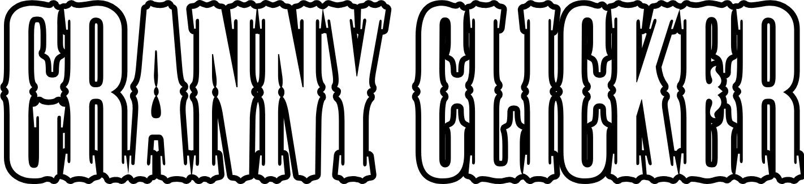

#  Granny Clicker


## 🎮 What is the game about?
**Granny Clicker** is an addictive, dynamic *incremental/clicker* game with a unique thriller twist based on the popular character Granny. Your goal is to click and collect currency (Granny Coins), upgrade your earnings, and avoid the terrifying jumpscare.

**Core Mechanics:**
* **Clicking & Upgrades:** Earn coins and purchase multipliers (e.g., 2x more coins per click) and Auto-Clickers.
* **Time Pressure (Jumpscare):** Granny has a hidden timer. If you are not careful and the timer reaches zero, you will get caught and lose a portion of your collected coins.
* **Progression (Coming soon in 1.1):** Player profiles, tiers with ranking points, shop modules, and encrypted password-protected save systems.

## 📂 Project Structure
The project is built using a clean web stack (HTML5, CSS3, JS) extended with Windows automation scripts. The structure is designed to easily compile the game into a standalone mobile app (.apk), a PC game (.exe) or other platforms.

```text
📁 Granny-Clicker/
├── 📁 assets/               # Game assets and media files
│   ├── 📁 fonts/            # Custom game typography
│   ├── 📁 lang/             # Language localization files
│   ├── 📁 sounds/           # Audio, ambient background tracks, and Granny's voice lines
│   └── 📁 textures/         # UI elements, backgrounds, and the official game logo
├── 📁 errors/               # Critical error pop-ups and notifications (.vbs files)
├── 📁 web/                  # Web engine files and source code
│   ├── 📁 game/             # Game screen logic and rendering
│   ├── 📁 scripts/          # Auxiliary and helper JavaScript files
│   ├── 📁 styles/           # Layout and design style sheets (.css)
│   └── 📁 title/            # Title/Main Menu screen components
├── 📄 index.html            # Main engine entry point and game interface
├── 📄 launch.cmd            # Windows batch command script to initialize and launch the game
├── 📄 package.json          # Configuration file (e.g., for bundling with NW.js for PC)
