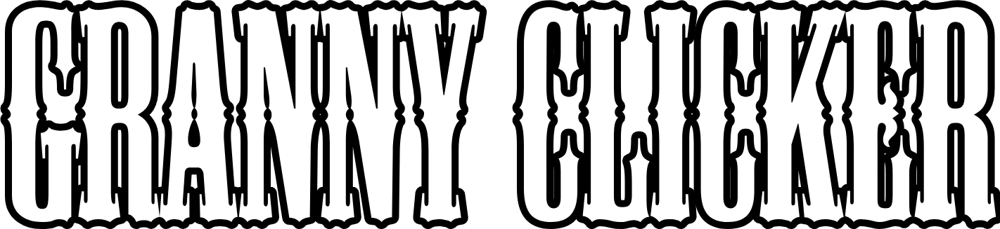

#  Granny Clicker


## 🎮 What is the game about?
**Granny Clicker** is an addictive, dynamic *incremental/clicker* game with a unique thriller twist based on the popular character Granny. Your goal is to click and collect currency (Granny Coins), upgrade your earnings, and avoid the terrifying jumpscare.

**Core Mechanics:**
* **Clicking & Upgrades:** Earn coins and purchase multipliers (e.g., 2x more coins per click) and Auto-Clickers.
* **Time Pressure (Jumpscare):** Granny has a hidden timer. If you are not careful and the timer reaches zero, you will get caught and lose a portion of your collected coins.
* **Progression (Coming soon in 1.1):** Player profiles, tiers with ranking points, shop modules, and encrypted password-protected save systems.

## 📂 Project Structure
The project is built using a clean web stack (HTML5, CSS3, JS) extended with Windows automation scripts. The structure is designed to easily compile the game into a standalone mobile app (.apk), a PC game (.exe) or other platforms.

```text
📁 Granny-Clicker/
├── 📁 assets/               # Game assets and media files
│   ├── 📁 fonts/            # Custom game typography
│   ├── 📁 lang/             # Language localization files
│   ├── 📁 sounds/           # Audio, ambient background tracks, and Granny's voice lines
│   └── 📁 textures/         # UI elements, backgrounds, and the official game logo
├── 📁 errors/               # Critical error pop-ups and notifications (.vbs files)
├── 📁 web/                  # Web engine files and source code
│   ├── 📁 game/             # Game screen logic and rendering
│   ├── 📁 scripts/          # Auxiliary and helper JavaScript files
│   ├── 📁 styles/           # Layout and design style sheets (.css)
│   └── 📁 title/            # Title/Main Menu screen components
├── 📄 index.html            # Main engine entry point and game interface
├── 📄 launch.cmd            # Windows batch command script to initialize and launch the game
├── 📄 package.json          # Configuration file (e.g., for bundling with NW.js for PC)
└── 📄 README.md             # Project documentation
```

# 🎮 Supported Platforms & Compatibility Matrix
This document outlines the target platforms, native file package formats, support status, and cross-platform compatibility exceptions for this project.
---
## 📱 Platform Overview
Below is the exhaustive list of supported and targeted operating systems along with their respective native package extensions.
### 1. 📱 Mobile
- [x]  **Android** (`.apk`, `.aab`) — *(Tested)*. Standard package output.
- [ ]  **iOS** (`.ipa`) — *(Not supported yet...)*
- [ ]  **HarmonyOS** (`.hap`, `.apk`) — *(Not supported yet...)*
- [ ]  **KaiOS** (`.zip` web app packages) — *(Not supported yet...)*
- [ ]  **Sailfish OS** (`.rpm`) — *(Not supported yet...)*
- [ ]  **Ubuntu Touch** (`.click`, `.snap`) — *(Not supported yet...)*
- [ ]  **Tizen OS** (`.wgt`, `.tpk`) — *(Not supported yet...)*
- [ ]  **Windows Phone / Mobile** (`.xap`, `.appx`) — *(Legacy, not supported)*
### 2. 🖥️ Desktop / PC
- [x]  **Windows** (`.exe`, `.msi`) — *(Tested)*
- [ ]  **macOS** (`.dmg`, `.app`, `.pkg`) — *(Built, not tested yet)*
- [ ]  **Linux** (Binary ELF, `.AppImage`, `.flatpak`, `.snap`) — *(Built, not tested yet)*
- [ ]  **ChromeOS** (Web Apps / `.apk`, `.deb`) — *(Not supported yet...)*
- [ ]  **BSD / FreeBSD** (Binary ELF, native `.pkg` / `.tgz`) — *(Not supported yet...)*
- [ ]  **Solaris / Illumos** (Binary ELF, `.p5p`, `.pkg`) — *(Not supported yet...)*
- [ ]  **Haiku OS** (`.hpkg`, Binary ELF) — *(Not supported yet...)*
### 3. 🎮 Consoles
- [ ]  **PlayStation 4 / 5** (`.pkg`) — *(Not supported yet...)*
- [ ]  **Nintendo Switch** (`.nsp`, `.xci`) — *(Not supported yet...)*
- [ ]  **Xbox One / Series X|S** (`.appx`, `.msixvc`) — *(Not supported yet...)*
- [ ]  **Steam Deck / SteamOS** (Binary ELF, `.AppImage`, Flatpak) — *(Not supported yet...)*
- [ ]  **PlayStation Vita** (`.vpk`) — *(Legacy, not supported)*
- [ ]  **Nintendo Wii U / 3DS** (`.rpx`, `.cia`) — *(Legacy, not supported)*
### 4. 📺 Smart TV & Streaming Devices
- [ ]  **Android TV / Google TV** (`.apk`) — *(Not supported yet...)*
- [ ]  **LG webOS** (`.ipk`) — *(Not supported yet...)*
- [ ]  **Samsung Tizen TV** (`.wgt`, `.tpk`) — *(Not supported yet...)*
- [ ]  **Amazon Fire TV** (`.apk`) — *(Not supported yet...)*
- [ ]  **Apple tvOS** (`.ipa`) — *(Not supported yet...)*
### 5. ⌚ Wearables & Smartwatches
- [ ]  **Wear OS** (`.apk`) — *(Not supported yet...)*
- [ ]  **Apple watchOS** (`.ipa`) — *(Not supported yet...)*
- [ ]  **Tizen OS Watch** (`.wgt`) — *(Legacy, not supported)*
- [ ]  **Fitbit OS** (`.fba`) — *(Legacy, not supported)*
### 6. 🚗 Automotive & Smart Displays
- [ ]  **Android Automotive OS** (`.apk`) — *(Not supported yet...)*
### 7. 🌐 Web & Browsers
- [x]  **WebAssembly / HTML5** (`.wasm`, `.js`, `.html`) — *(WebAssembly)*
---
## ⚡ Cross-Platform Compatibility Exceptions Matrix
Even when two operating systems share the same file extension (e.g., `.apk` or `.ipa`), cross-device execution is subject to runtime dependencies, binary ABI matching, and UI target considerations.
The table below describes valid cross-execution scenarios between platforms sharing package formats or binary containers:

| Source Package Format | Source Platform | Target System | Execution Compatibility | Conditions & Architectural Notes |
| :--- | :--- | :--- | :--- | :--- |
| **`.apk`** | Android Phone | **Android TV / Fire TV** | ⚠️ Partial | **Sideloadable.** Requires an external mouse/AirMouse if touch-only UI components are present. |
| **`.apk`** | Android Phone | **Wear OS (Smartwatch)** | ⚠️ Limited | **Sideloadable via ADB.** Execution works, but screen layout will clip on round displays unless responsive. |
| **`.apk`** | Android Phone | **HarmonyOS** | ✅ Native | **Direct support.** Works natively on EMUI/HarmonyOS (excluding HarmonyOS NEXT). |
| **`.apk`** | Android Phone | **ChromeOS** | ✅ Supported | **Native container.** Runs via built-in Android subsystem (ARC++ / ARCVM). |
| **`.ipa` / `.app`** | iOS (iPhone / iPad) | **macOS (Apple Silicon)** | ✅ Native | **Universal Binary.** Runs natively on M-series chips unless blocked by developer settings. |
| **`.ipa`** | iOS (iPhone) | **visionOS / tvOS** | ✅ Supported | Requires build target configured as Universal App in Xcode. |
| **`.exe` / `.msi`** | Windows (x86_64) | **Windows 11 (ARM64)** | ✅ Emulated | Runs seamlessly via Microsoft's built-in x86/x64-to-ARM64 binary translation layer. |
| **`.msix` / `.appx`** | Windows PC | **Xbox One / Series X\ | S** | ✅ Native | Universal Windows Platform (UWP) apps run across both desktop and console. |
| **Binary ELF** | Linux | **FreeBSD** | ⚠️ Emulated | Requires **Linux ABI Emulation** (`linux.ko` kernel module) enabled on FreeBSD. |
| **`.AppImage` / `.flatpak`** | Linux (Ubuntu/Debian) | **Steam Deck / Other Linux** | ✅ Universal | Fully portable. Containers bundle all required system libraries internally. |

---
### 🔍 Architectural Technical Notes
1. **ABI & Instruction Set Alignment:**
   A package compiled for ARM64 (`arm64-v8a`) will fail on `x86_64` targets unless an emulation sub-system is present (such as Rosetta 2 on macOS or ARCVM on ChromeOS).
2. **Android App Bundles (`.aab`):**
   Deployments targeting the Google Play Store use `.aab` to dynamically slice binaries, delivering only target-specific dynamic libraries and resolution assets to end devices.
3. **Portable Linux Packages (`.AppImage`, `.flatpak`):**
   These containers resolve distribution dependency hell by encapsulating `glibc` wrappers and shared object (`.so`) dependencies directly within the execution mount.
   
